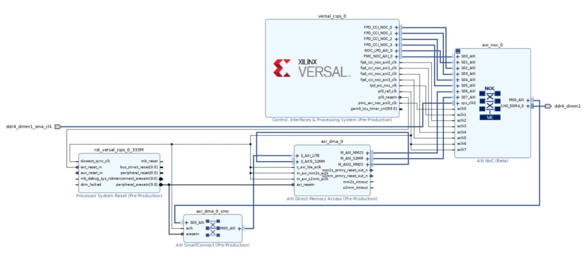
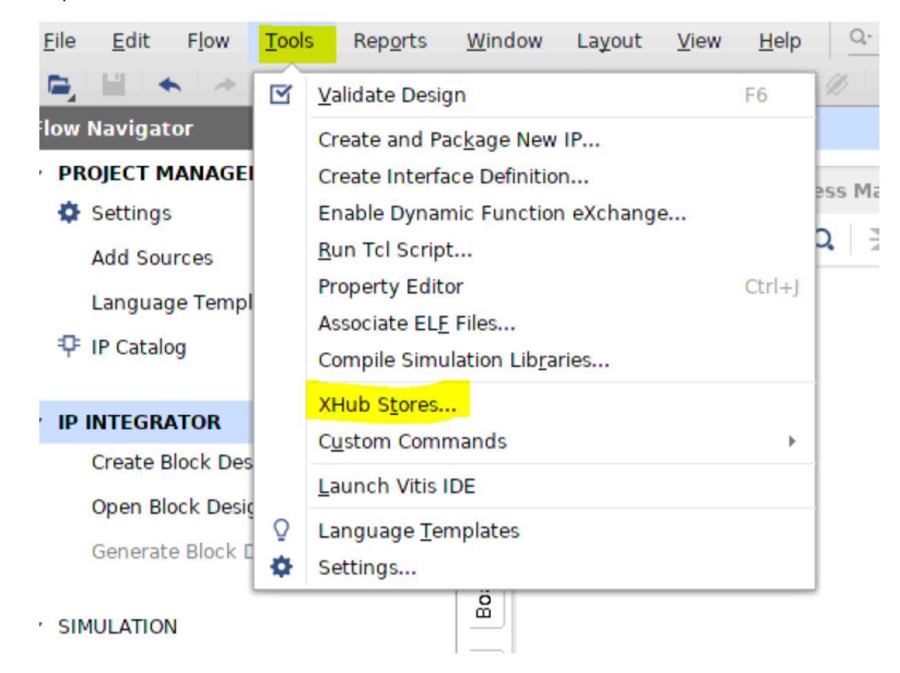
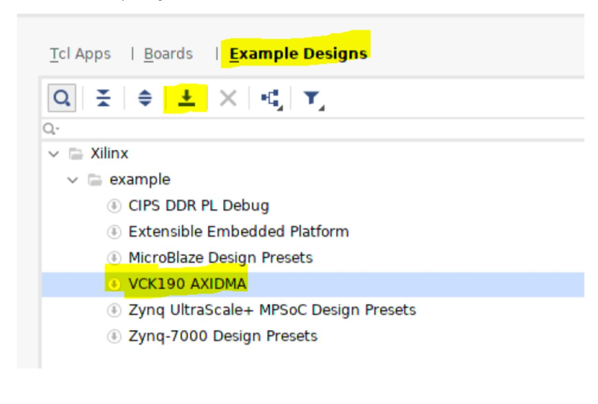
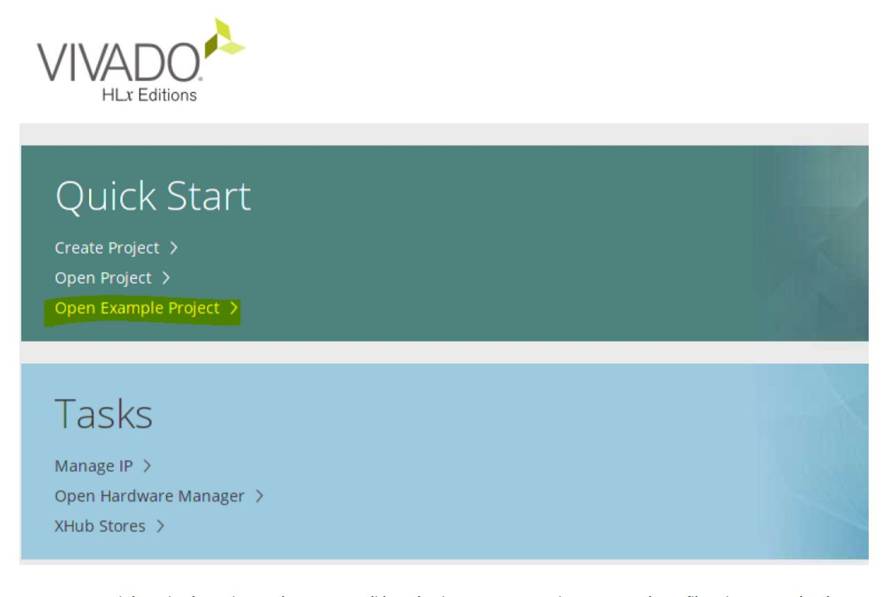
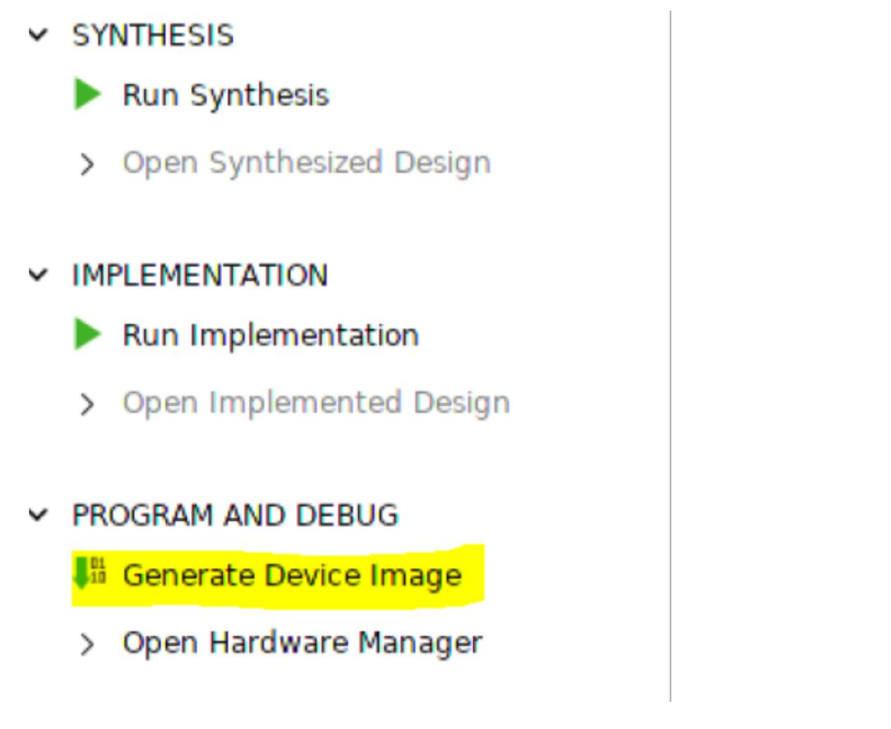
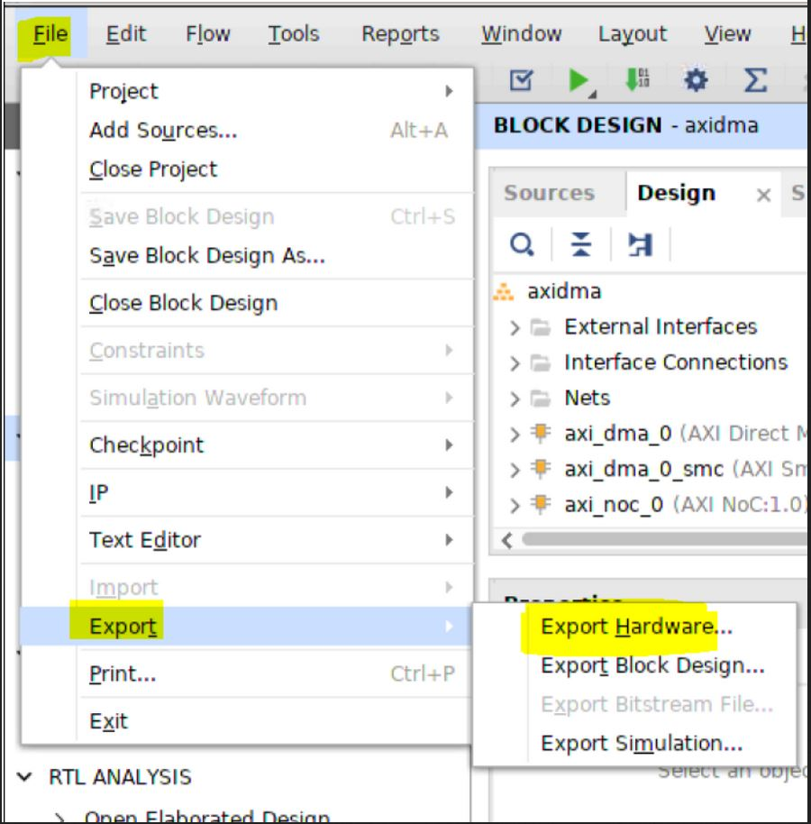
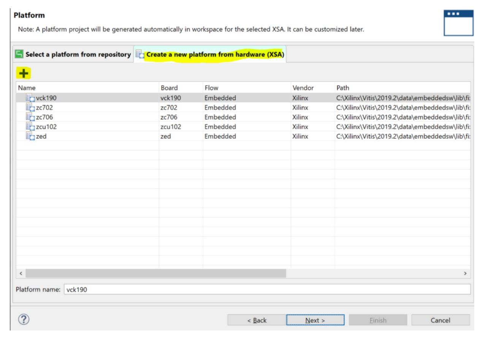
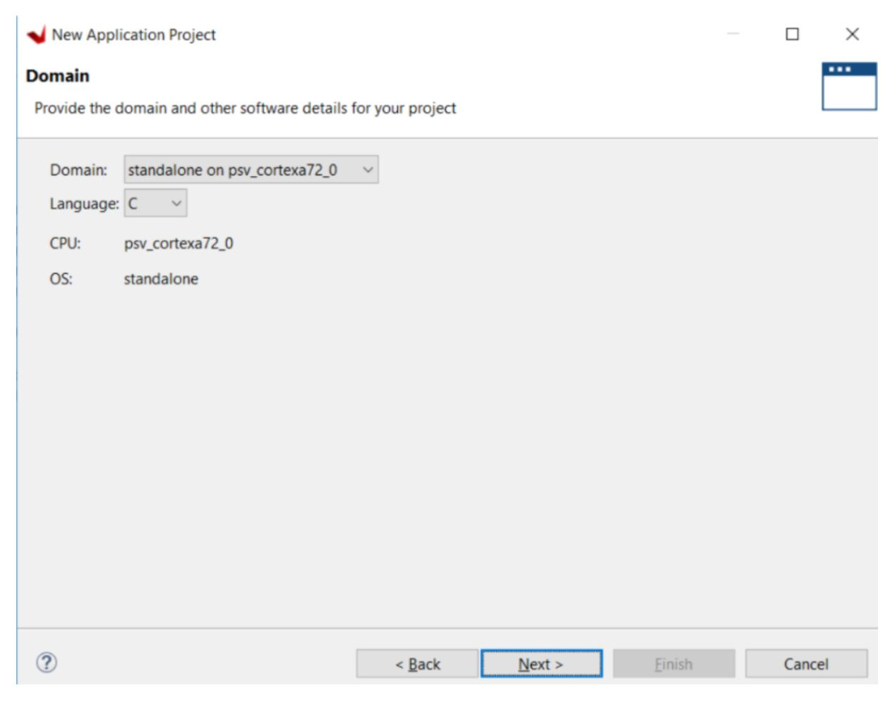
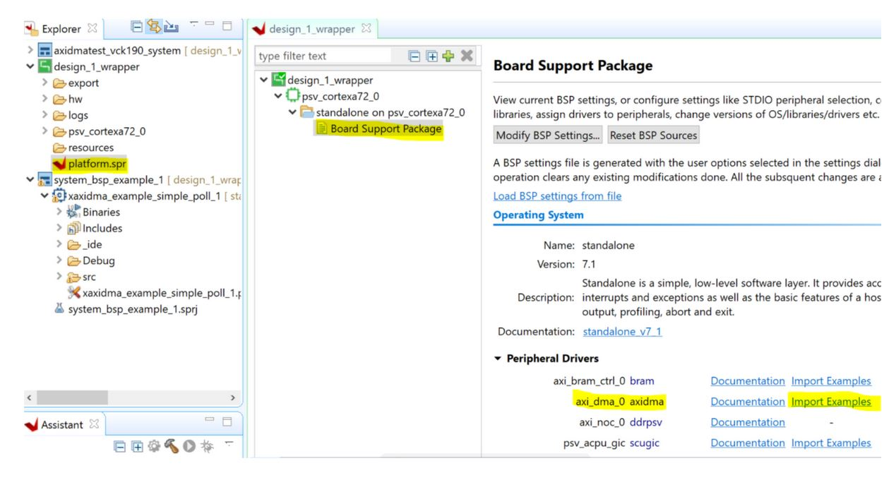

# VCK190 Example Design : AXI DMA
## Objective
The Versal example design will show how to run AXI DMA standalone application example on vck190 and intended to demonstrate the AXI DMA standalone driver which is available as part of the Xilinx Vivado and Vitis.
## Required Hardware and Tools
2023.1 Vivado and Vitis

VCK190 

Boot Mode: JTAG
## Block Diagram

## Design Steps

#### 1. Open vivado and select XHub Stores in Tools tab

#### 2. Install AXI DMA Example Design

#### 3. Close that window and select Open Example Project

#### 4. Create an axi dma vivado project and generate .pdi by selecting Generate Device Image and .xsa file using export hardware design.

## Vitis Steps

#### 1. Lanch Vitis and create an application project with a new platform from hardware (XSA) in Vitis.

#### 2. Browse an XSA file that is exported from Vivado by clicking '+" symbol and then next. 

#### 3. Select CPU as A72_0 then click next and select Hello World template and finish.

#### 4. Select the platform.spr file to import axi dma application example project as below and then build the project.

#### 5 Build the axi dma imported project and run this application on vck190 board.

## Console log:

### 2023  -  07:57:05
### [0.119]Platform Version: v2.0 PMC: v2.0, PS: v2.0
### [0.161]BOOTMODE: 0x0, MULTIBOOT: 0x0
### [0.191]****************************************
### [0.417]Non Secure Boot
### [3.313]PLM Initialization Time 
### [3.342]***********Boot PDI Load: Started***********
### [3.381]Loading PDI from SBI
### [3.408]Monolithic/Master Device
### [3.456]0.071 ms: PDI initialization time
### [3.492]+++Loading Image#: 0x1, Name: lpd, Id: 0x04210002
### [3.538]---Loading Partition#: 0x1, Id: 0xC
### [54.667] 51.084 ms for Partition#: 0x1, Size: 3024 Bytes
### [59.502]---Loading Partition#: 0x2, Id: 0xB
### [107.676] 44.357 ms for Partition#: 0x2, Size: 64112 Bytes
### [110.144]+++Loading Image#: 0x2, Name: pl_cfi, Id: 0x18700000
### [115.297]---Loading Partition#: 0x3, Id: 0x3
### [748.000] 628.801 ms for Partition#: 0x3, Size: 811264 Bytes
### [750.459]---Loading Partition#: 0x4, Id: 0x5
### [1187.352] 432.992 ms for Partition#: 0x4, Size: 577552 Bytes
### [1189.906]+++Loading Image#: 0x3, Name: fpd, Id: 0x0420C003
### [1195.056]---Loading Partition#: 0x5, Id: 0x8
### [1199.441] 0.405 ms for Partition#: 0x5, Size: 1536 Bytes
### [1204.061]***********Boot PDI Load: Done***********
### [1208.521]3243.516 ms: ROM Time
### [1211.306]Total PLM Boot Time 

### --- Entering main() --- 
### Successfully ran XAxiDma_SimplePoll Example
### --- Exiting main() --- 

